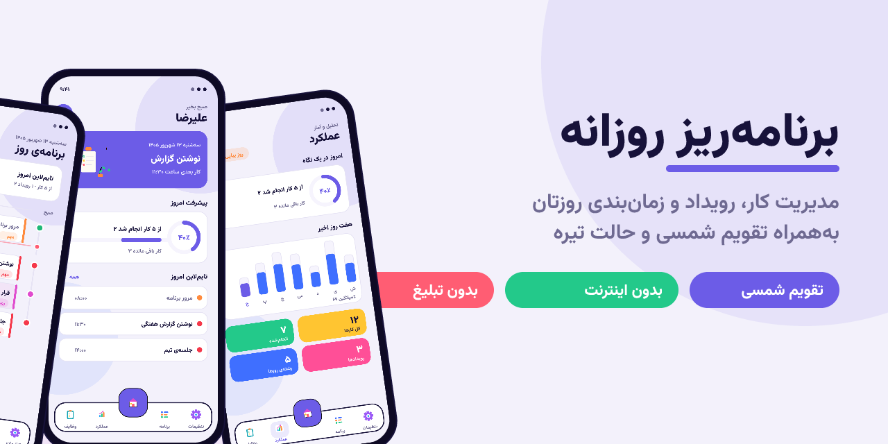
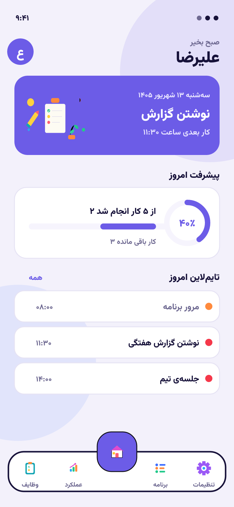
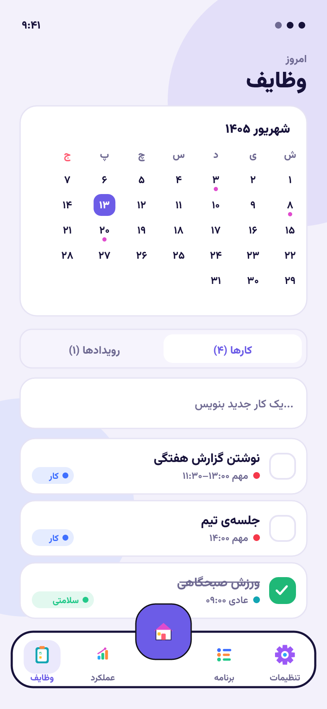
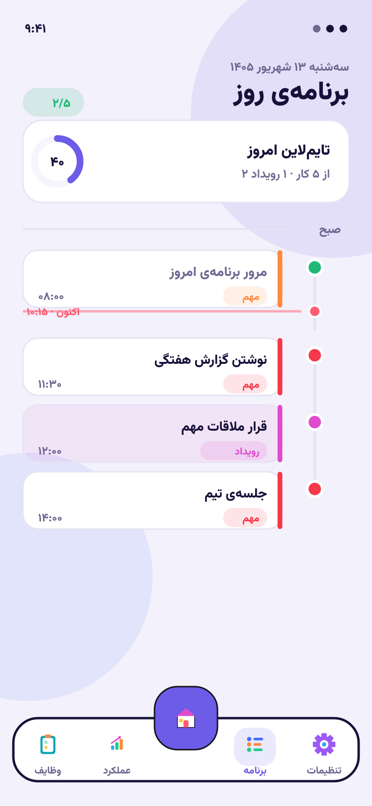
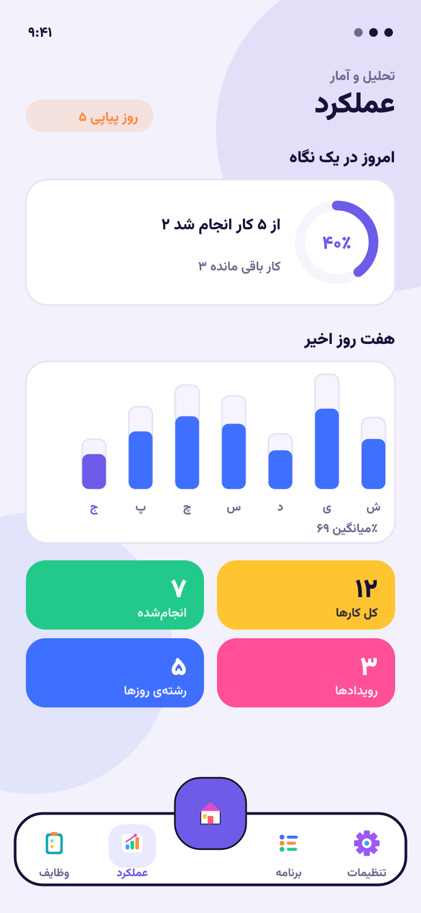
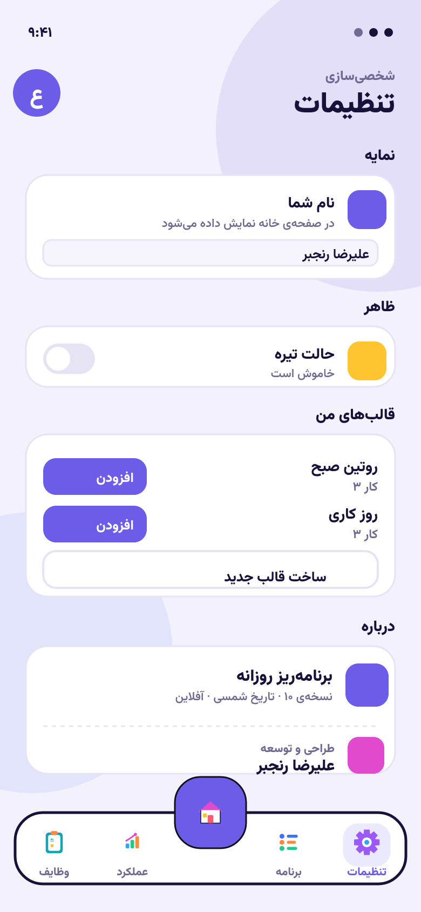
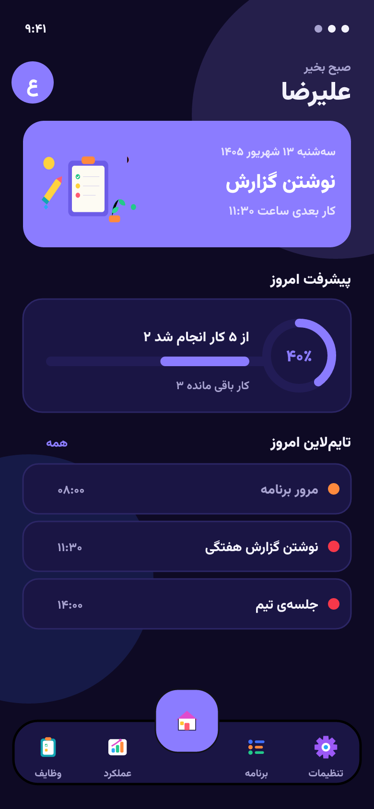

<div align="center">



# برنامه‌ریز روزانه

**یک اپلیکیشن مدیریت کار و زمان‌بندی روزانه با تقویم شمسی، طراحی مدرن و کاملاً آفلاین.**

[](https://github.com/Captain-Jorf/Planner/releases/latest)
[](https://github.com/Captain-Jorf/Planner/releases/latest/download/daily-planner.apk)
[](https://github.com/Captain-Jorf/Planner/actions/workflows/build-apk.yml)
[](LICENSE)

</div>

---

## درباره‌ی برنامه

**برنامه‌ریز روزانه** یک اپلیکیشن سبک و سریع برای مدیریت کارها، رویدادها و زمان‌بندی روز شماست. همه‌ی اطلاعات روی دستگاه خودتان ذخیره می‌شود؛ بدون نیاز به اینترنت، بدون حساب کاربری و بدون تبلیغات. تقویم برنامه به‌صورت کامل شمسی (جلالی) است و رابط کاربری آن با تمرکز بر خوانایی، تضاد رنگی مناسب و طراحی سه‌بعدی نئوپاپ ساخته شده است.

- **بدون اینترنت:** تمام داده‌ها به‌صورت محلی نگهداری می‌شوند.
- **حریم خصوصی:** هیچ داده‌ای جمع‌آوری یا ارسال نمی‌شود.
- **بدون تبلیغ و بدون اعلان مزاحم.**
- **تقویم شمسی** به‌صورت پیش‌فرض.
- **حالت روشن و تیره.**

---

## ویژگی‌ها

| ویژگی | توضیح |
| --- | --- |
| **مدیریت کارها** | افزودن، تکمیل و حذف کار با اولویت، ساعت شروع و مدت‌زمان. |
| **رویدادها با زمان پایان** | هر رویداد دارای ساعت شروع و پایان و رنگ اختصاصی است. |
| **برچسب‌های رنگی** | دسته‌بندی کارها با تگ‌های رنگی مانند کار، سلامتی و شخصی. |
| **کارهای تکرارشونده** | تعریف عادت‌ها و کارهای روزانه/هفتگی. |
| **تایم‌لاین یکپارچه** | نمایش کارها و رویدادها در یک خط زمانی واحد در صفحه‌ی خانه و برنامه. |
| **تقویم شمسی** | انتخاب روز از تقویم جلالی بدون سرریز از صفحه. |
| **داشبورد عملکرد** | نمودار هفت روز اخیر، درصد پیشرفت و آمار کلی. |
| **قالب‌های سفارشی** | ساخت قالب‌های دلخواه در تنظیمات و افزودن گروهی کارها. |
| **حالت تیره** | تم روشن و تیره با یک کلید. |
| **کاملاً آفلاین** | بدون نیاز به اینترنت یا حساب کاربری. |

---

## تصاویر برنامه

<div align="center">

| خانه | وظایف | برنامه‌ی روز |
| :---: | :---: | :---: |
|  |  |  |
| **عملکرد** | **تنظیمات** | **حالت تیره** |
|  |  |  |

</div>

---

## صفحه‌ها

نوار پایین شامل پنج دکمه است و دکمه‌ی خانه در مرکز قرار دارد:

- **وظایف** — تقویم شمسی به‌همراه فهرست کارها و رویدادهای هر روز.
- **عملکرد** — داشبورد آمار و تحلیل: پیشرفت امروز، نمودار هفتگی و شمارنده‌ها.
- **خانه** — نمای کلی روز: کارت بعدی، درصد پیشرفت و تایم‌لاین امروز.
- **برنامه** — خط زمانی (پایپ‌لاین) کارها و رویدادهای روز با نشانگر «اکنون».
- **تنظیمات** — نمایه، حالت تیره، برچسب‌ها، قالب‌های سفارشی و درباره.

---

## دانلود

آخرین نسخه‌ی APK را از بخش Releases دریافت کنید:

**[دانلود مستقیم آخرین نسخه](https://github.com/Captain-Jorf/Planner/releases/latest/download/daily-planner.apk)**

یا کد QR زیر را اسکن کنید:

<div align="center">
  
</div>

> پس از دانلود، ممکن است لازم باشد نصب از منابع ناشناس را در تنظیمات اندروید فعال کنید.

---

## اجرا و توسعه

پیش‌نیاز: Node.js نسخه‌ی ۱۸ به بالا.

```bash
# نصب وابستگی‌ها
npm install

# اجرای نسخه‌ی توسعه در مرورگر
npm run dev

# ساخت نسخه‌ی تولید
npm run build
```

### ساخت APK

```bash
# همگام‌سازی با پروژه‌ی اندروید و ساخت APK (نیازمند Android SDK و Java)
npm run apk
```

APK نهایی به‌صورت خودکار توسط GitHub Actions ساخته می‌شود: با هر push یک artifact و با هر tag از نوع `v*` یک Release منتشر می‌شود.

---

## معماری و فناوری‌ها

| بخش | فناوری |
| --- | --- |
| هسته | Vite + JavaScript خالص (بدون فریم‌ورک) |
| بسته‌بندی موبایل | Capacitor 6 (Android) |
| تقویم | jalaali-js |
| قلم | Vazirmatn |
| گرافیک | وکتورهای SVG دست‌ساز (بدون گرادیان) |
| ساخت APK | GitHub Actions |

ساختار پوشه‌ها:

```
src/
  main.js          مسیریابی و راه‌اندازی برنامه
  store.js         مدیریت وضعیت و ذخیره‌سازی محلی
  theme.css        استایل نئوپاپ و تم روشن/تیره
  navicons.js      آیکون‌های وکتوری نوار پایین
  illus.js         تصویرسازی‌های SVG دست‌ساز
  views/           صفحه‌ها: home, tasks, performance, agenda, settings
scripts/
  shots.mjs        ژنراتور اسکرین‌شات‌ها
  banner.mjs       ژنراتور بنر معرفی
docs/screens/      تصاویر برنامه
```

---

## توسعه‌دهنده

طراحی و توسعه: **علیرضا رنجبر**

---

## مجوز

این پروژه تحت مجوز [MIT](LICENSE) منتشر شده است.
